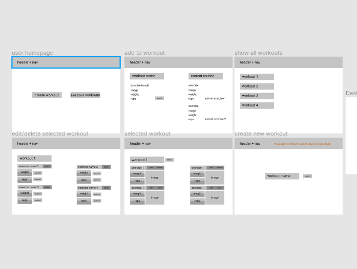
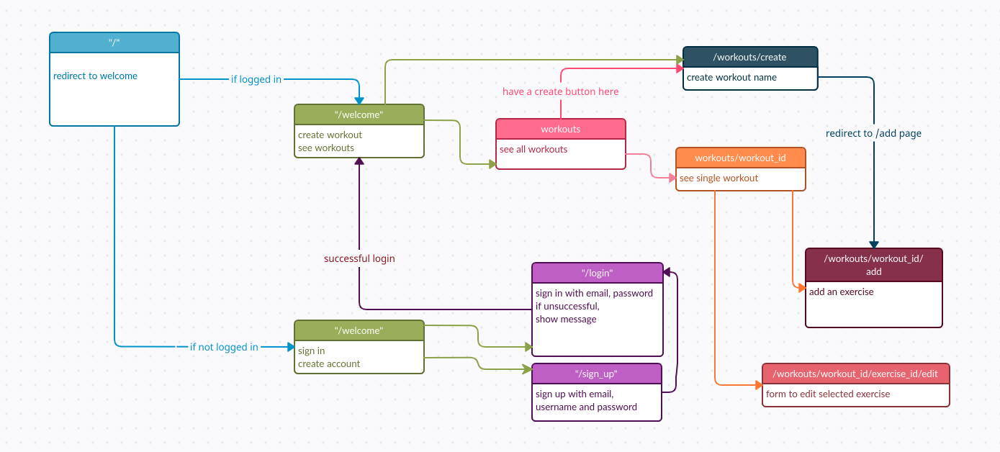
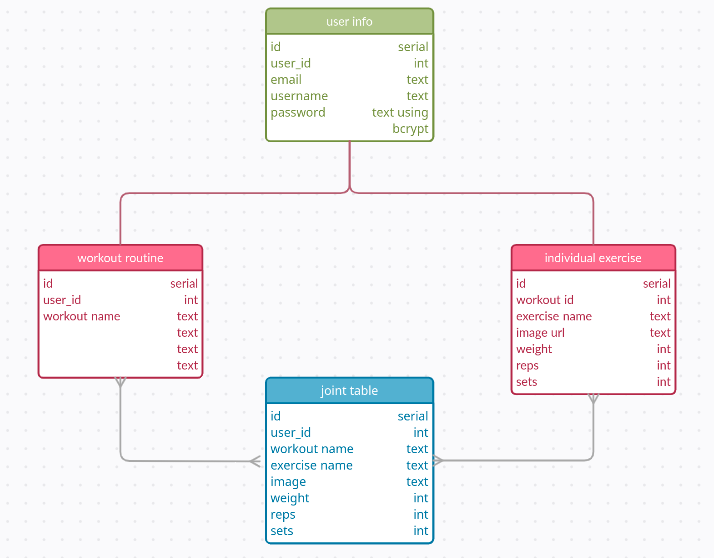

# My Fitness Tracker App
This is a workout routine log app using HTML/CSS, Ruby Sinatra and Postgres. deployed using Heroku.
Using this app, the user is able to create a workout routine with exercises. These exercises can include:
the name of the exercise, image URL, weights used, reps and sets done as well as add notes for each exercise!

## How To Use
1. Access the app [here.](https://hidden-lake-60801.herokuapp.com/)
2. Create a login to create a workout routine, add/edit exercises and read said workout and exercises.
3. Create a workout name and add exercises with the given parameters.
4. Access your workout routines and their exercises.

## Approaches
- Created diagrams to visualise layout of the app, databases and routes.
- Enable ability to create an account and sign in.
- Allow user to add a workout name and associate them with the user's ID
- Allow user to add exercises to the workout and associate them with the user's ID and the workout routine's ID.

### Diagrams

## Difficulties
- Using an API to generate images related to the exercise. Could only find premium APIs.
- Allowing user to update one feature of the exercise without having to re-input previous data.

## Features Wishlist
- Allow user to update header image. This can be done by having user submit an image link as a "profile image".
- Email and password validation.
- Interaction with an API to generate a relevant image for each exercise.
  - Could also incorporate videos instead of an image via an embedded player.
- Notify user when they have entered the wrong data type e.g. inserting text in the 'weight', 'reps', 'sets' inputs 